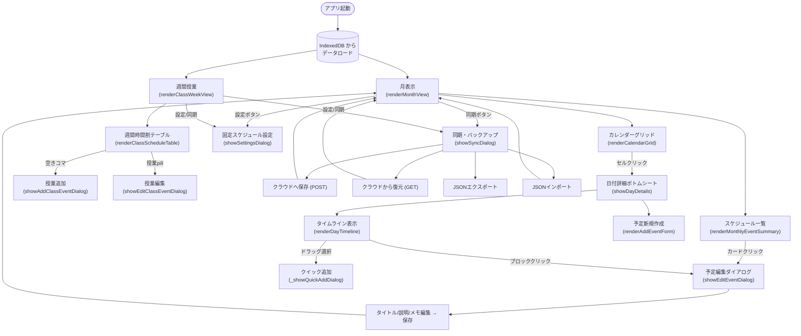
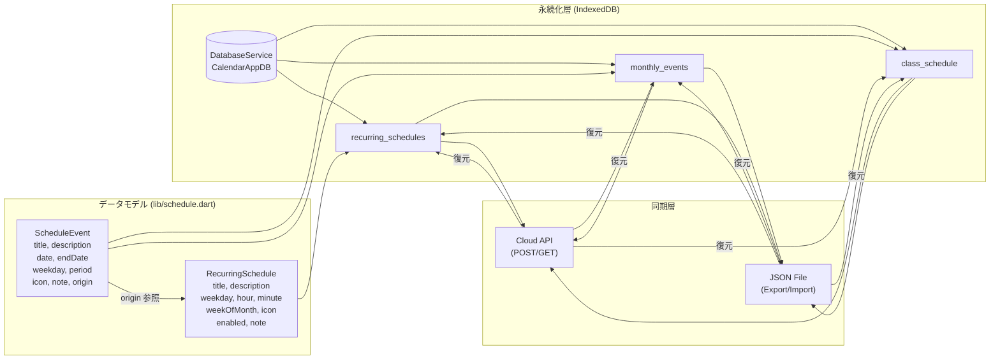
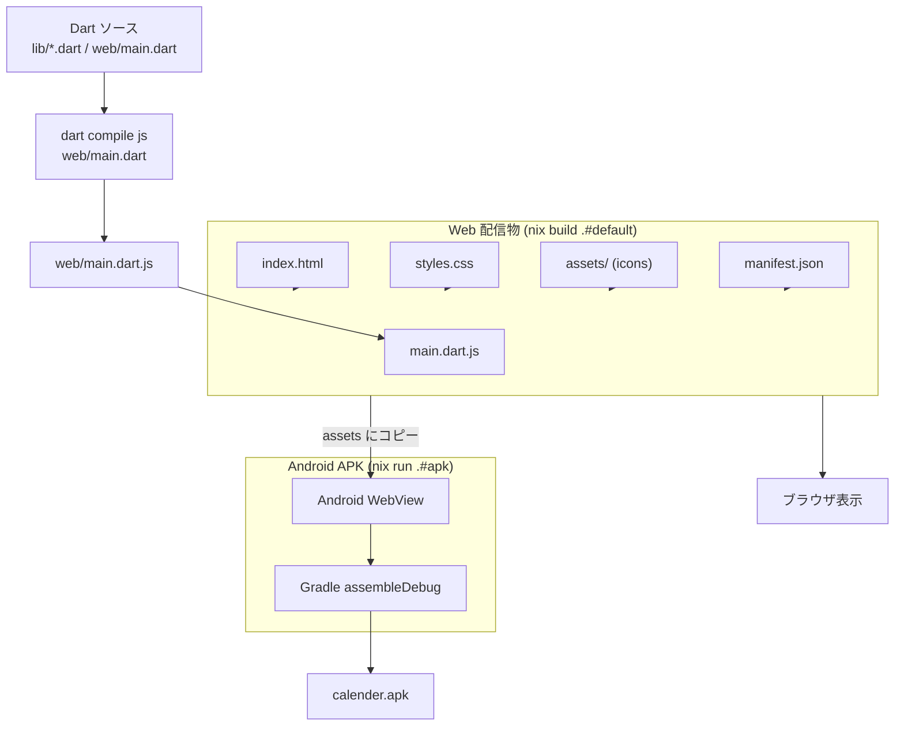

# Calender

Dart で作ったシンプルなスケジュール管理アプリです。  
月表示カレンダー + 週間授業スケジュール（大学生向け）を一つのアプリで提供します。

> **コードの詳しい解説**は [CODE_GUIDE.md](./CODE_GUIDE.md) を参照してください。  
> Dart を書いたことがない人でも理解できるよう、一歩ずつ噛み砕いて説明しています。

## 機能

- **月表示モード**: 1ヶ月分の予定をカレンダーに表示。毎日の予定をタイムラインで確認・追加・編集可能
- **週間授業モード**: 月〜金・1〜5限の時間割を表形式で一覧表示
- **固定スケジュール**: 毎週/第n週の定期予定を設定可能（cog アイコンで表示）
- **予定編集・メモ**: 各予定にメモを追加・編集可能
- **データ永続化**: IndexedDB に予定データを保存（ブラウザを閉じても保持）
- **テーマ切替**: Light / Dark / Auto に対応
- **スワイプ操作**: モバイルで左右スワイプによる月移動
- **クラウド同期**: 任意の API エンドポイントへのバックアップ・復元
- **ファイルバックアップ**: JSON ファイルへのエクスポート・インポート
- **PWA対応**: スマホのホーム画面に追加可能（manifest.json + アイコン）
- **日本祝日対応**: 日本の祝日を土日と同様に表示
- **APKビルド対応**: Android WebView アプリとして APK を生成可能

## スクリーンショット

| 月表示 | 週間授業 | タイムライン |
|--------|---------|------------|
| (TODO) | (TODO) | (TODO) |

## プロジェクト構成

```
calender/
├── lib/
│   └── schedule.dart          # データモデル (ScheduleEvent, RecurringSchedule)
├── web/
│   ├── index.html             # アプリのエントリポイント
│   ├── styles.css             # 全スタイル (Light/Dark テーマ)
│   ├── main.dart              # UI制御・表示ロジック (2087行)
│   ├── manifest.json          # PWA マニフェスト
│   ├── assets/                # アイコン画像
│   │   ├── icon.svg
│   │   ├── icon-192x192.png
│   │   ├── icon-512x512.png
│   │   ├── food_event_bg.png
│   │   └── flight_event_bg.png
│   └── dev/                   # 開発用テスト・検証ページ
│       ├── test_dart.html
│       ├── test_static.html
│       ├── test_drag.html
│       ├── verify.html
│       └── ...
├── android/
│   ├── build.gradle.kts
│   ├── settings.gradle.kts
│   ├── gradle.properties
│   └── app/
│       ├── build.gradle.kts
│       └── src/main/
│           ├── AndroidManifest.xml
│           └── java/com/calender/app/MainActivity.java
├── scripts/
│   └── generate_icons.py      # アイコン生成スクリプト (PIL)
├── pubspec.yaml               # Dart パッケージ定義
├── package.json               # Dev環境 (browser-sync, nodemon, concurrently)
├── flake.nix                  # Nix ビルド/開発環境定義
├── mise.toml                  # ツールバージョン管理 (dart, bun)
└── .gitignore
```

## フローチャート

### 画面遷移 (UI Navigation)



### データモデルと永続化



### ビルドパイプライン



## 実行方法

### ブラウザ (Dart → JS コンパイル)

```bash
# Dart SDK をインストール後
dart pub get
dart compile js web/main.dart -o web/main.dart.js
```

`web/index.html` をブラウザで開きます。

### 開発サーバー

```bash
# package.json の dev スクリプトを使用
bun install
bun run dev
```

### Nix (NixOS / Nix environment)

```bash
# 開発シェルに入る
nix develop

# Web ビルド
nix build .#default

# APK ビルド (Android)
nix run .#apk

# 開発サーバー起動
nix run .#dev
```

## 技術スタック

- **言語**: Dart (Web用に JavaScript へコンパイル)
- **UI**: 純粋な Dart HTML DOM API (フレームワーク未使用)
- **データ保存**: IndexedDB (ブラウザ)
- **アイコン**: Lucide (SVG アイコンライブラリ)
- **PWA対応**: Service Worker / Manifest
- **APK**: Android WebView (Gradle ビルド)
- **開発環境**: Nix flake / mise / bun / browser-sync
- **テーマ**: CSS カスタムプロパティ (Light/Dark/Auto)
